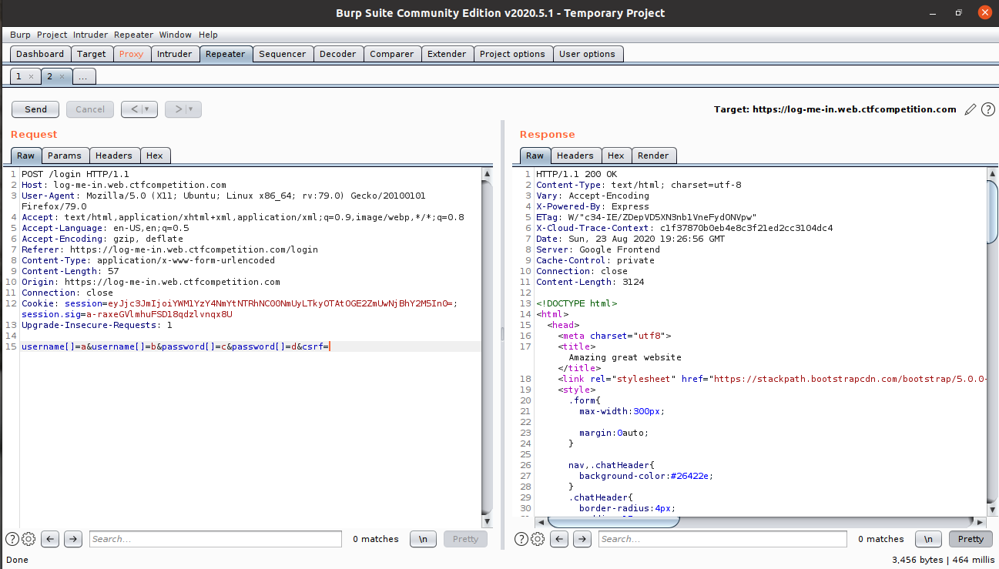
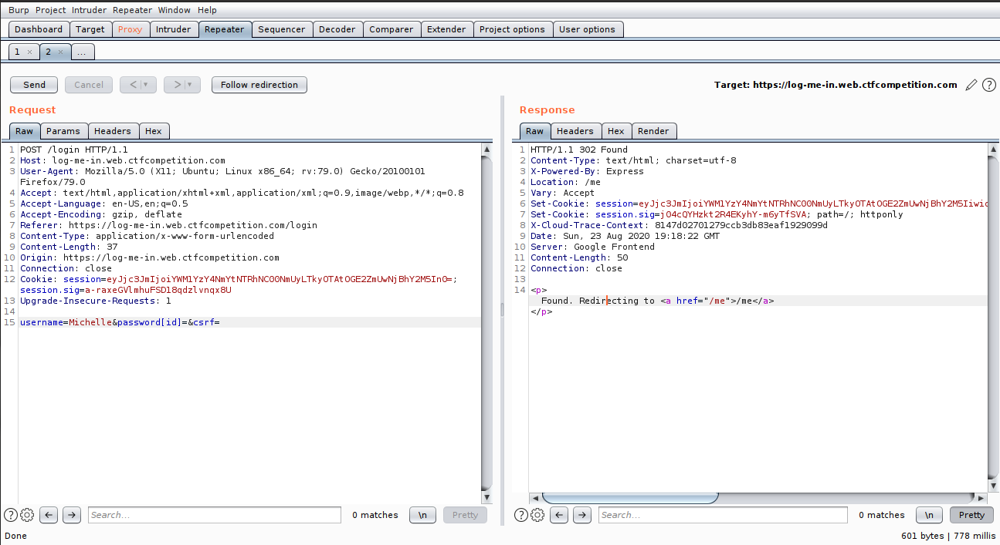
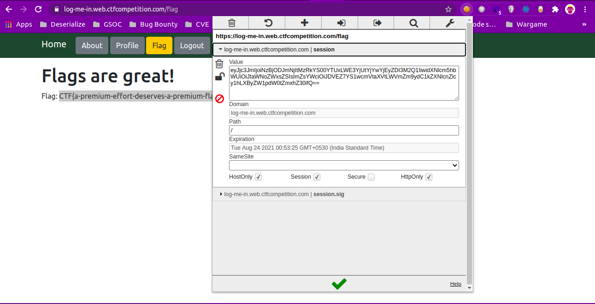

# Google CTF Log me in

**tl;dr**

+ 
+ 
+ 

**Challenge points**: 
**No. of solves**: 
**Challenge Author**: [m0n574](https://twitter.com/m0n574)

## Challenge description
Log in to get the flag

## Initial analysis
We are provided with an application which has the functionalities to login, view profile, About and view Flag. We are able to login as username: admin and password: admin but we are not able to get use the flag functionality since it says `Only Michelle's account has the flag` =_=

We were also provided with a source code and one of the main thing to notice is `app.use(bodyParser.urlencoded({extended: true}))` and we can send sql params as arrays and it will be parsed. In the cookies there was session cookie with the value `eyJ1c2VybmFtZSI6ImFkbWluIiwiZmxhZyI6IjxzcGFuIGNsYXNzPXRleHQtZGFuZ2VyPk9ubHkgTWljaGVsbGUncyBhY2NvdW50IGhhcyB0aGUgZmxhZzwvc3Bhbj4ifQ==` decoded as {"username":"admin","flag":"Only Michelle's account has the flag"} and session.sig.

So what we had to do was to find michelles session and session.sig and get the flag.

When we pass the request as `username[]=a&username[]=b&password[]=c&password[]=d&csrf=` we get the error:
Unknown error: Error: ER_PARSE_ERROR: You have an error in your SQL syntax; check the manual that corresponds to your MySQL server version for the right syntax to use near &#39; &#39;b&#39; and password = &#39;c&#39;, &#39;d&#39; order by id&#39; at line 1

When we finally send the request as `username=Michelle&password[id]=&csrf=` we get michelles session and session.sig 

After that when we give to the admin|admin cookies, we will be able to access the flag
 

## Flag

**FLAG**: `CTF{a-premium-effort-deserves-a-premium-flag}`

For further queries, please DM me on Twitter: <https://twitter.com/m0n574>.